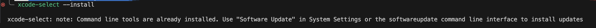
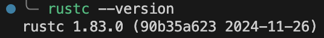

# 설치

## 1. rustup 설치

- Mac과 Linux의 경우에 curl로 설치
```
$ curl --proto '=https' --tlsv1.2 https://sh.rustup.rs -sSf | sh
```
- C 컴파일러 설치 (기본적으로 있을듯?)
```
$ xcode-select --install
```
 역시 있었다.
<br/>
<br/>
## 2. 설치 확인

- 설치 확인
```
$ rustc --version
```
